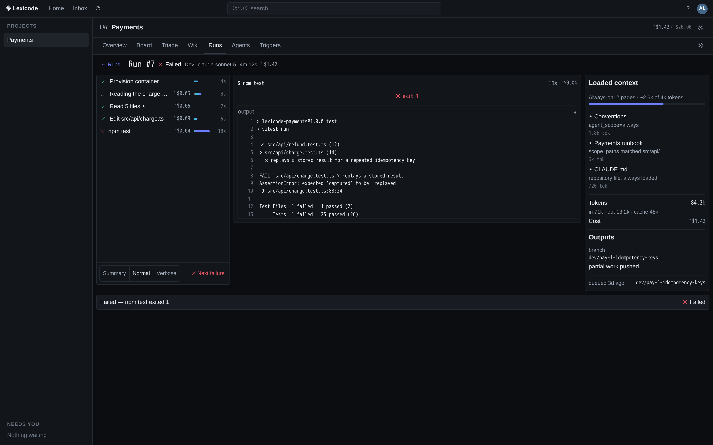
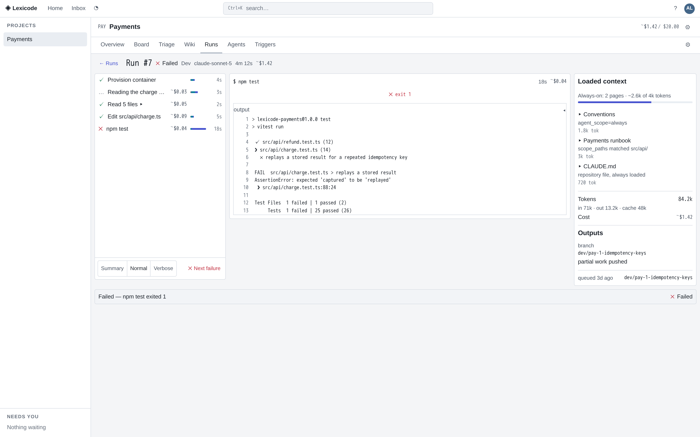
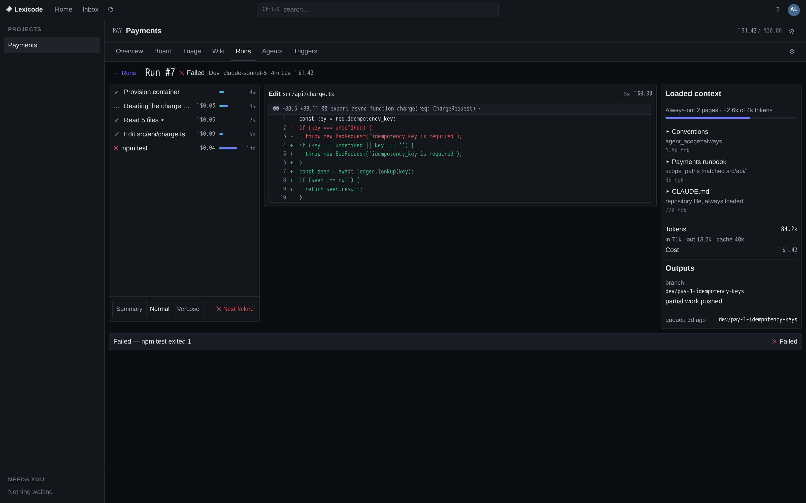
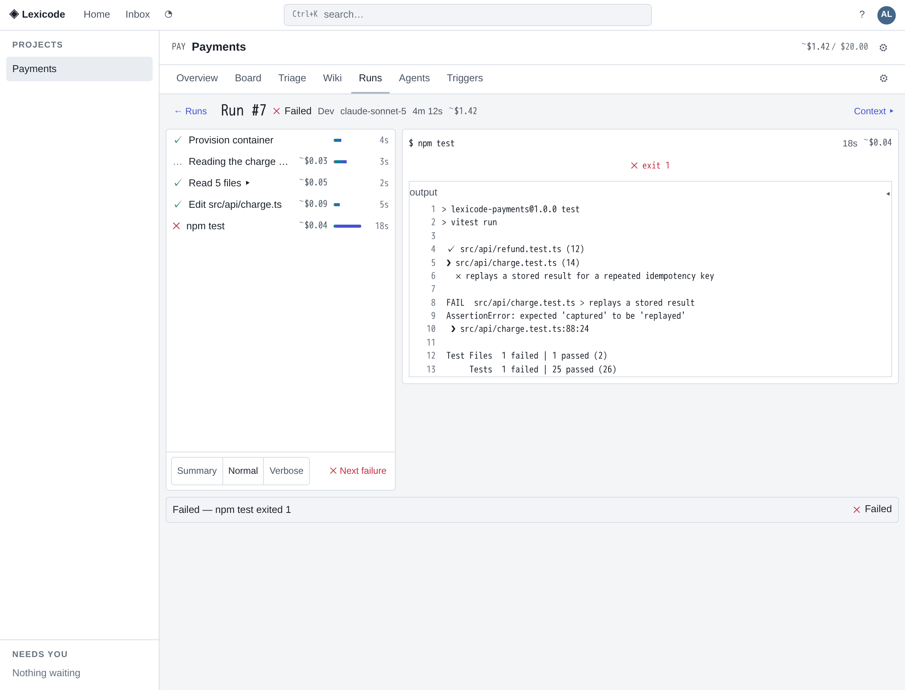

# Component library evaluation

**Date:** August 2026 · **Ticket:** LEXI-13 · **Decision recorded as:** amendment A-1 to
[D-1](../plan/00-decisions.md).

Lexicode's UI was built without a component library, on the reasoning in D-1. The owner is
reversing that. This document is the evidence for which library replaces it.

Six candidates were compared against **this** product's needs rather than against a generic
checklist. Every number below was measured or fetched in August 2026; nothing is quoted from
memory.

---

## What Lexicode actually needs

Drawn from the UI spec and from the code that exists, not from a wish list.

| # | Need | Where it bites |
|---|---|---|
| 1 | **Dense data.** 32px rows, 13px text, 12px monospace, compact mode at 28px (spec §2.2). "Whitespace is a cost, not a virtue." | Every list, table and timeline. A library tuned for a marketing site fights this on every component. |
| 2 | **Live updates.** SSE frames land in a TanStack Query cache and re-render lists mid-scroll. | Run list, run detail, board, inbox, the left rail. |
| 3 | **Drag and drop** on the board, which must **never** start a run (spec §9 rule 2 — a product-level invariant). | `BoardPage.tsx`. |
| 4 | **A three-pane log viewer** — timeline · tool-aware detail · context & cost — with a live verbosity switch and permalinkable log lines (spec §5.7). | `RunDetailPage.tsx`, the hardest screen in the app. |
| 5 | **Virtualised lists** of hundreds of rows. A 500-step run must scroll at 60fps. | `VirtualList.tsx`. |
| 6 | **Light and dark as equal citizens**, driven by ~16 CSS custom properties that a test asserts contrast floors against (`tokens.contrast.test.ts`). | Everywhere. This is the constraint most libraries fail. |
| 7 | **Accessibility with teeth.** Zero critical axe violations on every route, a focus ring that is never removed, colour never the sole carrier of status, live regions that announce state changes but not log spam (spec §10). | Everywhere; asserted by `axe.test.tsx`, `focusRings.test.ts`, `statusDotUsage.test.ts`. |
| 8 | **A single binary.** The bundle is `go:embed`-ed; every kilobyte ships forever and is downloaded once per install, not per page view. | Changes how bundle size should be weighed — see below. |

**On bundle size specifically.** Lexicode is a self-hosted binary on a laptop, serving a handful of
users over localhost. Bundle size is a *build artifact* concern, not a
time-to-first-paint-on-3G concern. It is a real cost — a bigger binary, a slower cold parse — but
it is the cheapest of the eight criteria to spend, and treating it as decisive would be
cargo-culting a constraint from a different kind of product.

---

## How the numbers were produced

**Bundle size** was measured, not looked up. A scratch Vite 7 + React 19 project was built once per
library with an identical, representative component set — button, text input, select, table,
dialog/modal, menu, tabs, badge/chip, tooltip, switch, alert, progress, plus the library's theme
provider — with production minification and gzip. The React-only baseline was subtracted.

Identical inputs, one variable. The absolute numbers are less interesting than the ordering and the
size of the gaps.

| Library | Total gzip | **Delta over React baseline** | CSS payload | Notes |
|---|---|---|---|---|
| *(baseline: React 19 + ReactDOM)* | 60.6 kB | — | — | |
| **Mantine 9.5** | 135.5 kB | **+74.9 kB** | +38.0 kB gzip (`styles.css`) | ~113 kB all-in; per-component CSS imports can cut it |
| **react-aria-components 1.20** | 152.9 kB | **+92.3 kB** | 0 (you write all of it) | unstyled: the CSS you'd add is not counted here |
| **Material UI 9.3** | 155.6 kB | **+95.0 kB** | 0 (CSS-in-JS) | |
| **Fluent UI v9 (9.74)** | 167.7 kB | **+107.2 kB** | 0 (Griffel) | |
| **Chakra UI 3.36** | 175.5 kB | **+114.9 kB** | 0 (CSS-in-JS) | |
| **Ant Design 6.6** | 294.2 kB | **+233.6 kB** | 0 (CSS-in-JS) | 3.1× the winner |

**Maintenance health** is npm and GitHub as of 2026-08-25.

| Library | Latest | Last publish | Weekly downloads | Stars | Open issues | Verdict |
|---|---|---|---|---|---|---|
| Material UI | 9.3.1 | 2026-08-06 | 10.4M | 98.9k | 1,492 | Healthiest in the category by every measure |
| Ant Design | 6.6.1 | 2026-08-17 | 3.8M | 99.2k | 1,091 | Very healthy |
| Mantine | 9.5.2 | 2026-08-22 | 2.4M | 31.6k | **49** | Healthy, and a remarkably clean issue tracker |
| react-aria-components | 1.20.0 | 2026-08-14 | 4.1M | 15.8k (react-spectrum) | 591 | Healthy; Adobe-funded |
| Chakra UI | 3.36.1 | 2026-07-19 | 1.8M | 40.6k | **12** | Healthy |
| Fluent UI v9 | 9.74.7 | 2026-08-25 | 394k | 20.2k | 760 | Healthy but much smaller adoption |

All six are actively maintained; none is a bus-factor risk. **Maintenance health does not
discriminate between these candidates**, and pretending otherwise would be padding.

---

## The comparison

### Material UI 9 — **recommended**

| Criterion | Assessment |
|---|---|
| Dense data | Adequate, not native. `size="small"`, `dense`, `disableGutters` and `padding="none"` exist on the relevant components, and the theme sets 13px body and 4px radii globally. But Material's defaults are roomy, and hitting 32px rows means overriding padding in the theme rather than picking a density preset. **This is real work and it is not free.** |
| Live updates | No opinion — it is a rendering library over React state. Composes with TanStack Query without ceremony. |
| Drag and drop | **Not provided.** Native HTML5 drag (what the board uses today) keeps working; MUI neither helps nor hinders. |
| Three-pane run detail | **Served, with two named compositions.** Proven, not asserted — see the proof of concept below. |
| Virtualised lists | **The weak spot.** MUI X Data Grid's virtualisation is a **Pro (paid) tier** feature; the MIT grid does sorting, filtering, pagination and editing but not virtualisation. Verified against the MUI X docs. |
| Light / dark | **The deciding strength.** `cssVariables: true` lets the palette be CSS custom properties: `palette.success.main` is literally `var(--ok)`. `tokens.css` stays the source of truth, the existing `data-theme` switch keeps working, and the contrast test keeps its teeth. |
| Accessibility | Good and improving. v9's release notes name accessibility as a headline: `aria-hidden` removed from the modal backdrop (it used to hide content from assistive tech), pointer events instead of mouse events, and borders added so components survive Windows High Contrast Mode. Not best-in-class — that is React Aria — but well above the median. |
| Maintenance | Best in the category: 10.4M weekly downloads, published this month. |
| Bundle | +95.0 kB gzip in the benchmark; **+96.6 kB measured in the real app**. |

#### Where Material UI is weak for *this* product

Stated plainly, because a recommendation that only lists strengths is not a recommendation.

1. **Density is a fight, not a setting.** Material Design is a spacious language. Spec §2.2 is the
   opposite. Every list, table and timeline needs explicit padding overrides, and each one is a
   place the spec can drift. Mitigation: the overrides live in `theme.ts`, in one file, not
   sprinkled through screens — but they are still overrides, and a MUI upgrade can move the
   ground under them.
2. **Virtualisation is behind a paywall.** MUI X Pro owns the virtualised grid. Lexicode's
   `VirtualList.tsx` (~80 lines, no dependencies, exact because rows are fixed-height) stays, and
   MUI's `ListItemButton` renders inside it. That works, and it is documented as a composition —
   but it means the library does *not* cover need #5, and if a future screen wants a virtualised
   **table** (two-dimensional, resizable columns), the choice is a licence or a second library.
3. **Emotion is a runtime style engine.** Styles are serialised during render. On a run detail
   streaming hundreds of rows this is a real cost, mitigated here by the fact that the virtual
   window is ~25 rows regardless of run length. It has not shown up in practice; it is a thing to
   watch, not a thing to panic about. (MUI's Pigment CSS offers zero-runtime extraction later, at
   the price of a build-time plugin.)
4. **The visual language has to be actively suppressed.** Ripples off, elevation off, uppercase
   button text off, shadows replaced by hairlines. All done in `theme.ts`. It works, but the
   library is pulling one way and the spec the other, permanently.
5. **`component=` does not compose with TanStack Router's types.** Writing
   `<Button component={Link} to="/p/$key" params={{ key }}>` fails to typecheck: MUI's polymorphic
   `component` prop and the router's `params` reducer disagree. Fixed once, in
   `web/src/theme/routerLinks.tsx`, using the router's own `createLink` escape hatch — about 20
   lines of glue for the whole app. Worth knowing about; not a reason to reject.
6. **`cssVariables: true` is load-bearing, and it is not the default.** Without it, MUI calls
   `alpha()` on palette values at render time, `alpha()` cannot parse a `var()`, and `Button`
   throws *"Unsupported `var(--accent)` color"* on first render. Discovered by trying it. With the
   flag on, the same derivations go through `color-mix()`, which takes custom properties happily.
   The entire token-by-reference strategy rests on one boolean; a future MUI major that changes how
   that flag works is the biggest single upgrade risk in this recommendation.
7. **Every palette slot you do not set is filled with a light-mode literal, silently.**
   `createPalette` defaults `action.active` to `rgba(0, 0, 0, 0.54)`, `action.hover` to
   `rgba(0, 0, 0, 0.04)`, and so on. Those are not neutral placeholders — they are *colours*, and
   they do not follow `data-theme`. `ToggleButton` colours its **unselected** label from
   `palette.action.active`, so the run detail's verbosity switch rendered its Summary and Verbose
   options in near-black on `--surface`: fine in light, invisible in dark.

   This is the sharpest edge of paying by reference, and it is worth being precise about why it is
   dangerous rather than merely annoying. **No test in this repository could see it.** jsdom
   renders no colours, so `axe.test.tsx` cannot; axe's own contrast rule needs real layout and is
   disabled for that reason; and `tokens.contrast.test.ts` checks `tokens.css`, which was never
   wrong — the theme simply was not consulting it for that slot. It was found by screenshotting
   the real production bundle in both themes (`web/scripts/screenshot.mjs`), and it is the reason
   that harness is committed rather than thrown away.

   Fixed in `theme.ts` by setting `action.active` to `var(--text-2)`, and pinned by
   `theme.tokens.test.ts`, which asserts *structurally* that no `palette.action` slot is left on a
   Material literal — so the next unset slot fails by name instead of shipping. Mitigated, not
   eliminated: the guard covers the slots we know components read, and MUI is free to add more.

### Mantine 9 — rejected (the closest call)

**Best on the two criteria that mattered most, and rejected anyway.**

Mantine is the densest of the six out of the box, styles with real CSS Modules (no runtime style
engine), themes from CSS custom properties natively, and has the smallest JS delta at +74.9 kB.
Its issue tracker — 49 open on 31.6k stars — is the cleanest in the comparison. On paper it is the
better technical fit.

Three reasons it lost:

1. **The CSS payload cancels the JS win.** +74.9 kB JS but +38.0 kB gzip of stylesheet, so ~113 kB
   all-in against Material UI's ~95 kB. Per-component CSS imports would trim it, at the cost of an
   import-discipline rule that nobody enforces at 3pm on a Friday.
2. **A hard React peer pin.** `@mantine/core@9.5.2` declares `react: "^19.2.0"` — an exact-minor
   peer range, where MUI accepts `^17 || ^18 || ^19`. For a project that pins its own React and
   upgrades deliberately, a library that can block a React patch upgrade is a coupling worth
   avoiding.
3. **Breadth.** 2.4M weekly downloads against MUI's 10.4M. For a UI being rebuilt by agents as much
   as by people, the volume of documentation, worked examples and Stack Overflow answers is a real
   input — the library everything already knows how to use is easier to build with correctly.

Mantine is the right answer if the density fight with Material becomes intolerable. It is the
documented fallback, not a dismissal.

### Ant Design 6 — rejected

**Rejected on accessibility, and it would have been rejected on size anyway.**

Ant Design is the most complete component set here and its enterprise table is genuinely excellent
for dense data. But there is no dedicated accessibility documentation, and the project's own issue
tracker carries long-running, repeatedly-reopened threads about screen-reader support, keyboard
navigation and invalid ARIA attributes — including a nine-year-old issue titled *"Ant Design
currently generates inaccessible forms. Blind people cannot use forms made by Ant Design."* and a
2025 discussion asking when WCAG issues will be addressed. Independent reviews reach the same
conclusion: caution for projects with strict accessibility standards.

Lexicode's spec §10 is not aspirational — it is enforced by `axe.test.tsx`, `focusRings.test.ts`,
`tokens.contrast.test.ts` and `statusDotUsage.test.ts` in CI. Adopting a library whose
accessibility is a known open question means fighting the test suite forever.

Independently: +233.6 kB gzip, 3.1× the winner. Either reason alone is disqualifying.

### Chakra UI 3 — rejected

Genuinely accessible (built on Ark UI / Zag state machines) and a pleasure to use. Rejected on
three counts: the largest CSS-in-JS delta after Ant Design (+114.9 kB); a design language and
spacing scale even more airy than Material's, which is the wrong direction for §2.2; and a v2→v3
rewrite recent enough that a large share of the examples and answers on the internet describe an
API that no longer exists — the opposite of the breadth argument that favours MUI.

### Fluent UI v9 — rejected

The strongest accessibility story of the *styled* candidates: Microsoft ships high-contrast support
and keyboard behaviour as product requirements, not as issues. Its `Griffel` engine does
build-time atomic CSS, which is technically the nicest styling story here.

Rejected on ecosystem and fit. 394k weekly downloads — an order of magnitude below MUI — with
correspondingly thin third-party material. And its visual language is Microsoft 365, which is a
strong, recognisable identity pulling against a dev-tool product that the spec explicitly places in
the "Linear / Vercel / Sentry lane". Overriding a strong identity is harder than overriding a
neutral one.

### React Aria Components 1.20 — rejected, with a caveat

The best accessibility in the industry, full stop: Adobe funds real assistive-technology testing,
and the keyboard and focus behaviour is the reference implementation everyone else is measured
against. 4.1M weekly downloads.

Rejected because **it is not a component library**, and this ticket explicitly asks for one and
says *do not invent components*. React Aria Components ships behaviour and accessibility with no
styling: adopting it means writing every visual treatment for every component by hand. That is the
status quo — hand-made components with a hand-made design system — plus a dependency. It would fix
the accessibility half of the problem while leaving the discoverability half exactly where it is,
because a `<Button>` you still have to style is a `<Button>` you still have to *decide to add*.

The caveat: this is the right choice for a product with a strong bespoke visual identity and the
budget to build a design system. Lexicode has neither, and its problem is not that its components
look wrong.

### Also considered, briefly

- **shadcn/ui + Radix.** Copy-in components, which means the components become yours to maintain
  the moment you paste them. That is exactly the arrangement A-1 is reversing, and it fails the
  ticket's "do not invent components" rule by construction.
- **Base UI (MUI's headless line).** At `1.0.0-rc.0` in July 2026. Same unstyled objection as React
  Aria, plus release-candidate risk. Worth revisiting if MUI's runtime styling ever becomes the
  problem.

---

## The proof of concept

The recommendation is not a paper exercise. **The run detail — `/p/:key/runs/:id`, the hardest
screen in the app** — is converted and merged on this branch. It was chosen because it exercises
every limit at once: a three-pane layout, a live SSE stream, a virtualised timeline, a radio-style
verbosity switch, a dense selectable list, inline approvals, a modal, and the entire §4 status
vocabulary.

### What it looks like

These are the real screen: headless Chromium driving `web/dist` — the same bundle `go:embed`
ships — with the API stubbed at the network layer. `web/scripts/screenshot.mjs` regenerates them.

**Dark.** The three panes, the collapsed `Read 5 files ▸` group, the timing gutters with their
queued/model/tool split, and the **Next failure** button this conversion added, beside the
verbosity switch.

**Light.** The same screen and the same components; only `tokens.css` changed underneath them.

**The centre pane is tool-aware** (§5.7): selecting the edit step renders a diff hunk rather than
raw JSON. Note that added and removed lines carry `+`/`−` as well as colour — §10's rule that
colour is never the sole carrier applies to diffs too.

**Below 1400px** the context pane collapses behind a labelled `Context ▸` toggle rather than
disappearing (§10).

These are not decoration. Weakness #7 above — the invisible `ToggleButton` labels in dark mode —
was found in the first of these images and was invisible to every test in the repository.

**What the library supplied:** `Box` · `Paper` · `Stack` · `Typography` · `Button` ·
`ToggleButtonGroup`/`ToggleButton` · `Tooltip` · `Chip` · `Alert`/`AlertTitle` · `Divider` ·
`List`/`ListItem`/`ListItemButton` · `Accordion` · `Dialog` · `TextField` · `Checkbox` ·
`FormControlLabel` · `LinearProgress` · `Link`.

**What needed composition, declared in each file's header:**

| Composition | Built from | Why the library has no answer |
|---|---|---|
| The three-pane frame | `Box` (CSS grid) + `Paper` per pane | MUI ships no application-layout component |
| The virtualised timeline | `VirtualList.tsx` + `ListItemButton` rows | MUI's virtualised grid is a paid tier |
| Numbered, line-addressable log output | `List component="ol"` + `ListItemButton` per line | No log viewer in any of the six |
| Diff hunks | `Paper` + `Typography` + the log composition | Same |
| The timing gutter (queued/model/tool) | Three `Box` segments in a `Tooltip` | A three-segment micro-bar is not a library component |
| `StatusDot` | `Box` + `Typography` + theme palette | The §4 vocabulary is Lexicode's own; the *rendering* is now library primitives |

### What the conversion actually bought

Not theory — things that were wrong and are now right:

- **The take-over dialog** was a `
` inside a backdrop `
` with an `onClick`.
  No focus trap, no Escape, no focus restoration, and a dismissal path a keyboard user could not
  take. It is now `Dialog` + `DialogTitle` + `DialogContent` + `DialogActions`, and all four
  behaviours arrive for free.
- **`CostChip`'s cost breakdown** was a `title` attribute: invisible to touch, un-tunable, and
  unreachable by keyboard. It is now a `Tooltip` that opens on focus.
- **The context budget meter** was two `
`s faking a bar. It is now `LinearProgress`, which
  brings `role="progressbar"` and its value bounds.
- **`f` — "next failure" — had no visible control at all.** It now has a labelled button beside the
  verbosity switch, sharing one implementation with the chord, disabled with the reason in a
  tooltip when a run has no failures.
- **~1,090 lines of hand-written CSS left `runs.module.css`** without a single visual rule being
  re-authored by hand.
- **The verbosity switch's unselected options were illegible in dark mode** — Material's
  `palette.action.active` default, weakness #7 — and are not any more. That one is listed under
  what the conversion *cost*, honestly: MUI introduced the bug and MUI's theme fixed it. It is
  here because the interesting part is that it took a screenshot to see it.

### Measured cost, in the real app

| | Before | After | Delta |
|---|---|---|---|
| JS (gzip) | 195.25 kB | 291.91 kB | **+96.66 kB** |
| CSS (gzip) | 20.08 kB | 16.90 kB | **−3.18 kB** |
| **Total** | **215.33 kB** | **308.81 kB** | **+93.48 kB** |

Read this correctly: **the +96 kB is a one-time toll**, paid in full by the first converted screen.
Every screen after it adds close to zero JS and *returns* CSS. With all screens converted the
remaining ~17 kB of CSS modules comes back, putting the steady state at roughly **+76 kB gzip** —
about 0.8% of a 9 MB binary.

### Verification

`make check` passes with the conversion in place: Go build, vet, `golangci-lint`, `go test`, then
`tsc -b --noEmit`, `eslint` and the frontend suite — including the axe suite (zero critical
violations on all 20 routes), the route-reachability crawl, the contrast assertions over both
palettes, six new tests in `runDetail.mui.test.tsx` that pin the converted screen's own acceptance
(no action reachable only by keyboard, the §4 vocabulary intact, both themes resolving, the empty
state still saying what to do next), and four in `theme/theme.tokens.test.ts` that pin the
token-by-reference arrangement itself.

Both new suites were **mutation-checked** rather than merely observed to pass: removing the
`action.active` fix fails `theme.tokens.test.ts` by name with the offending literal in the
message, and renaming the Next-failure button fails `runDetail.mui.test.tsx`. A guard that has
never been seen to fail is not yet a guard.

---

## Did the research change the plan?

Yes, in four ways.

1. **The migration is ordered by discoverability value, not by screen size.** The audit found ten
   of fifteen hidden actions on the board, six of them retired by a single card overflow menu. The
   board therefore moves ahead of larger and more visible screens in the staging.

2. **Two of the eight needs are not met by the library and never will be.** Drag-and-drop and
   virtualisation stay ours. That is fine — both are already built and working — but it means "MUI
   covers the UI" is not true, and the plan says so rather than discovering it in stage 4.

3. **The token-by-reference approach turned a risk into a non-issue, and created a new one.** The
   original fear — that a library's defaults would drift from the transcribed §3 tokens — is
   answered structurally: the palette *is* the tokens, so drift is impossible rather than merely
   discouraged. In exchange, the whole arrangement depends on `cssVariables: true` continuing to
   route derived colours through `color-mix()`. That is now the single upgrade risk worth watching,
   and it is pinned by tests that fail loudly if it ever stops being true.

4. **The test suite has a blind spot the migration has to plan around, and now has a tool for.**
   This repository's accessibility guarantees are strong but they are all *structural*: axe over
   jsdom (which renders no colour), arithmetic over `tokens.css`, a crawl over the route tree.
   Nothing in `make check` looks at a pixel. That was survivable while every colour was written by
   hand in a CSS module; it is not survivable when a library fills in colours you did not ask for
   (weakness #7). So `web/scripts/screenshot.mjs` is committed, and **every stage of the migration
   ends by rendering its converted screens in both themes and looking at them.** It is deliberately
   not wired into `make check` — it needs a browser binary and the check must stay installable —
   which makes it a checklist item rather than a gate. Naming it here is the honest version: it is
   a habit the plan depends on, not an automated guarantee.

---

## Sources

- [Introducing Material UI and MUI X v9](https://mui.com/blog/introducing-mui-v9/) — v9's accessibility work and the `color-mix()` CSS-variable extension
- [MUI X Data Grid](https://mui.com/x/react-data-grid/) — the Community/Pro/Premium split; virtualisation is Pro
- [MUI X Data Grid — Accessibility](https://mui.com/x/react-data-grid/accessibility/) — WCAG AA as the stated target
- [Mantine v9.0.0 changelog](https://mantine.dev/changelog/9-0-0/) — CSS Modules, native dark theme
- [Ant Design discussion #55332 — "WCAG Accessibility Issues in Ant Design Components"](https://github.com/ant-design/ant-design/discussions/55332)
- [Ant Design issue #16270 — inaccessible forms](https://github.com/ant-design/ant-design/issues/16270)
- [Ant Design issue #39199 — Select accessibility](https://github.com/ant-design/ant-design/issues/39199)
- npm registry and GitHub REST API, 2026-08-25, for versions, publish dates, downloads, stars and open-issue counts
- Bundle sizes: measured locally, Vite 7 production builds, React 19, gzip
